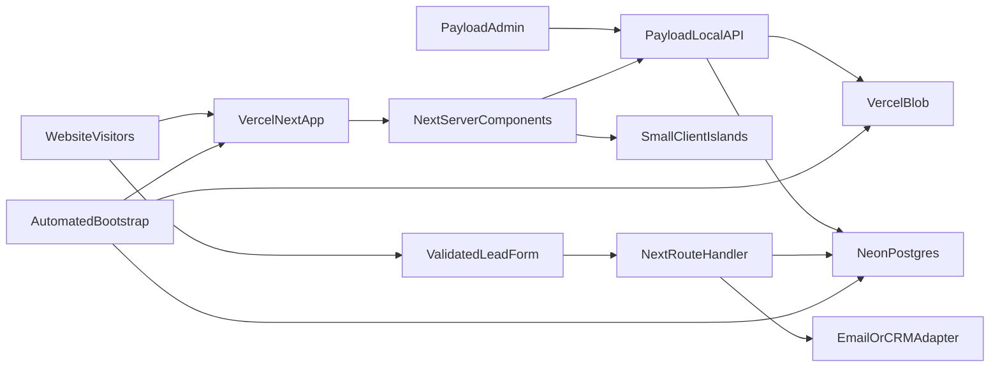

# aiio website architecture remediation

## Assessment

Yes, it can be fixed without a rewrite. The premise is only partly correct: the repository already has reusable primitives and page factories in [`components/brand/BrandCanonFoundation.tsx`](components/brand/BrandCanonFoundation.tsx), [`app/website-architecture.tsx`](app/website-architecture.tsx), and [`app/layer-page.tsx`](app/layer-page.tsx). The real problems are uneven component boundaries, content coupled to rendering, a 17k-line global stylesheet, large client-side islands, no working content backend, mailto forms, conflicting deployment paths, weak automated quality gates, and a fragmented English/German information architecture.

Highest-risk evidence:
- [`app/globals.css`](app/globals.css): global page-specific styling and accumulated overrides loaded on every route.
- [`app/resource-pages.tsx`](app/resource-pages.tsx): content, forms, special pages, and generic rendering combined in one large module.
- [`app/category-reinforcement.tsx`](app/category-reinforcement.tsx): content, motion, pointer behavior, and multiple sections inside one large Client Component.
- [`package.json`](package.json), [`vite.config.ts`](vite.config.ts), and [`vercel.json`](vercel.json): local vinext/Cloudflare workflow diverges from Vercel’s native Next.js production build.
- [`app/editor/content.tsx`](app/editor/content.tsx): the apparent editing layer is a no-op stub.
- [`db/schema.ts`](db/schema.ts): the database is intentionally empty; the D1/Drizzle code is unused scaffolding.
- [`app/layout.tsx`](app/layout.tsx): root canonical `/` can be inherited by unrelated routes.
- No CI, automated tests, or reliable server-side form processing.

## Target architecture

- Vercel and native Next.js become the only default build/runtime path.
- Server Components render static/editorial content; Client Components are limited to navigation, lightbox, and purposeful motion.
- Payload runs inside the same Next.js application and provides the admin UI, authentication, Local API, REST API, access control, drafts, and publishing workflow without a separate CMS subscription.
- Neon Postgres stores Payload content, users, revisions, media metadata, and lead records. Vercel Blob stores uploaded media and documents; no persistent files are written to the serverless filesystem.
- A shared route handler or Server Action handles lead forms with schema validation, spam protection, consent capture, database persistence, and an email/CRM adapter.
- One canonical capability model, CTA vocabulary, locale strategy, and token source feed all pages.

## Implementation sequence

### 1. Stabilize the platform and quality gates
- Make `next dev`, `next build`, and `next start` canonical in [`package.json`](package.json); remove or quarantine vinext, Cloudflare Worker, D1, and example scaffolding after confirming no production dependency.
- Correct TypeScript coverage in [`tsconfig.json`](tsconfig.json), add `typecheck`, and add PR checks for install, lint, theory consistency, typecheck, build, and smoke tests.
- Bring [`.gitignore`](.gitignore) to the required baseline, first renaming the source [`build/`](build/) directory so it does not conflict with ignored build output.
- Reduce tracked review artifacts and establish one canonical documentation/brand source rather than retaining duplicated review trees.

### 2. Repair SEO, routing, and information architecture
- Remove the site-wide canonical `/` from [`app/layout.tsx`](app/layout.tsx); add route-specific metadata and canonicals to flagship and resource routes.
- Choose canonical destinations for contact, company, academy, and capability pages; preserve old URLs with redirects rather than duplicate narratives.
- Establish a deliberate locale strategy for English flagship content and German legacy/resource content; ensure route-level language metadata matches visible copy.
- Unify navigation, footer, and CTA labels around one primary conversion path and make Thinking the editorial center of gravity.

### 3. Refactor content and component boundaries
- Keep and tighten the existing brand primitives; move shared navigation helpers and the duplicated executive CTA into canonical components.
- Split [`app/resource-pages.tsx`](app/resource-pages.tsx) into typed content adapters, a `ResourcePageLayout`, a form component, and a dedicated Business Impact page.
- Split [`app/category-reinforcement.tsx`](app/category-reinforcement.tsx) into server-rendered section shells, separate content models, and lazy interactive islands.
- Extract page-specific sections from home, platform, and company into `components/sections/*` only where they have clear ownership or reuse; avoid turning every wrapper into a component.
- Consolidate the duplicated capability journey into one typed source consumed by home, platform, academy, and legacy redirects.

### 4. Establish a portable, high-end frontend design system
- Do not lock the current fragmented CSS as the system. First audit the brand canon, typography, illustrations, strongest existing pages, target audience, and desired editorial tone; then produce two or three deliberately different page-direction prototypes for review.
- After one direction is approved, create root [`design.md`](design.md) as the concise, human-readable contract for genre, visual thesis, macrostructure family, typography roles, palette, spacing, CTA voice, imagery, motion stance, interaction principles, responsive behavior, accessibility, and explicit anti-patterns. Future frontend work must read it before implementation.
- Treat `tokens.css` as the executable source of truth and reference it from `design.md`. Use semantic OKLCH color tokens, a 4-point spacing scale, fluid type and space with `clamp()`, content measures, grid/gutter tokens, easing/duration tokens, radius rules, z-index layers, and component state tokens.
- Generate or validate any Tailwind v4 `@theme`, TypeScript token types, and DTCG `tokens.json` from the canonical token source rather than maintaining independent hand-edited copies. Remove the orphaned token duplication in [`components/brand/design-tokens.ts`](components/brand/design-tokens.ts).
- Define a small set of reusable page archetypes with distinct structural jobs: category manifesto, long-form theory/publication, platform workbench, evidence-led success story, institutional/company narrative, and focused conversion. Shared visual language stays consistent, but each archetype has different rhythm and composition so the site does not collapse into hero → cards → CTA repetition.
- Record legitimate page-family variations in a `## Variants` section of `design.md`; forbid untracked one-off colors, fonts, radii, shadows, animation curves, and layout primitives inside page components.
- Build bespoke brand primitives and editorial components rather than applying a generic UI kit across the marketing site. Use accessible native semantics and headless primitives only where interaction complexity warrants them.
- Add a component workshop in Storybook or an equivalent isolated preview surface for typography, color, spacing, navigation, buttons, forms, cards, media, editorial blocks, and all interaction states. Keep it development-only and use it for visual review, accessibility checks, and regression snapshots.
- Use modern CSS intentionally: cascade layers, CSS Modules, container queries, logical properties, `aspect-ratio`, `color-mix()` where progressive enhancement is safe, and fluid responsive rules. Avoid novelty that harms browser support, readability, or maintenance.
- Define motion as a restrained narrative system: at most a few meaningful primitives, transform/opacity only, shared timing tokens, no scroll-jacking, no ornamental parallax by default, and complete `prefers-reduced-motion` behavior.
- Define an art-direction system for real customer evidence, diagrams, photography, and brand-canon illustrations. Use `next/image`, responsive sizes, explicit aspect ratios, AVIF/WebP delivery, and stable placeholders; do not fabricate customer proof, metrics, logos, or testimonial content.
- Run a Hallmark anti-slop review before accepting each page family: strong hierarchy, structural variety, specific brand expression, restrained effects, no generic purple-gradient SaaS treatment, no wall of identical cards, no excessive eyebrow labels, no fake browser/device chrome, and no invented evidence.

### 5. Replace the styling monolith incrementally
- Reduce [`app/globals.css`](app/globals.css) to cascade layers for tokens, reset, fonts, accessibility, and truly global primitives.
- Move route/section styles into co-located CSS Modules in vertical slices, deleting superseded sprint-era rules after visual regression checks.
- Preserve the distinctive brand illustrations and strongest editorial patterns while implementing the approved `design.md` system rather than visually rewriting every page ad hoc.
- Split static brand imagery from optional interactive lightbox behavior so ordinary images do not force a client boundary.

### 6. Integrate Payload into the existing Next.js application
- Add Payload 3 directly to the existing app using `withPayload` in [`next.config.ts`](next.config.ts), a root `payload.config.ts`, and isolated Payload route groups for `/admin` and `/api`.
- Use Payload’s official Postgres adapter with pooled `DATABASE_URL` connections and the Vercel Blob storage adapter for the `media` collection.
- Define focused collections for admin users, publications, authors, categories, resource pages, success stories/proof, media, reusable CTAs, site settings, redirects, and leads. Use typed blocks only for genuinely variable article bodies; do not introduce an unrestricted page builder.
- Add role-based admin access, drafts, scheduled publishing where supported, version history, preview URLs, field-level validation, and hooks that invalidate affected Next.js cache tags after publishing.
- Query Payload through its server-side Local API from Server Components. Keep administrative and secret-bearing code server-only and avoid browser-side REST calls for normal page rendering.

### 7. Automate Vercel, database, storage, migrations, and first-run setup
- Add a repeatable bootstrap script under `/scripts` that checks `vercel --version` and `vercel whoami`, links the correct Vercel team/project, and stops for an explicit project choice rather than provisioning into an unknown account.
- Provision Neon through the Vercel Marketplace integration, wait for resource readiness, verify the expected database variables by name, and pull them into `.env.local` without printing secret values. Use provider CLI/API fallback only when Marketplace provisioning is unavailable.
- Provision a Vercel Blob store, attach it to the project, verify `BLOB_READ_WRITE_TOKEN`, and configure Payload’s media adapter. Treat local filesystem uploads as unsupported in production.
- Generate `PAYLOAD_SECRET` securely, store it as a sensitive Vercel variable for development, preview, and production, then refresh local environment variables. Commit an `.env.example` containing names only.
- Separate environments: production uses the production Neon database; preview deployments use isolated Neon branches or a dedicated preview database; tests use a disposable database. Preview builds must never migrate or seed production.
- Commit Payload migration files. Add `db:migrate:create`, `db:migrate`, `db:status`, `db:seed`, `db:reset:test`, and `bootstrap` scripts. Production CI runs pending migrations before `next build`; local setup runs migrations only after project linking and environment verification.
- Implement idempotent seeding for required roles, site settings, redirects, and imported content. Bootstrap the first administrator from temporary sensitive environment variables, verify login, then remove or rotate the bootstrap password.
- Before production migrations, create a Neon branch/restore point. Define rollback as application rollback plus a compatible down migration or database branch restore; never rely on destructive schema push in production.
- Make the bootstrap script resumable and safe to rerun: every step detects existing linkage, integrations, variables, migrations, and seed records before creating anything.
- Document the unavoidable boundary: automation can perform setup after Vercel authentication and team/project selection, but it cannot bypass provider consent, billing acceptance, or a Marketplace handoff that requires one dashboard confirmation.

### 8. Add the functional lead backend
- Replace mailto forms in [`app/resource-pages.tsx`](app/resource-pages.tsx) and [`app/live-demo/kontakt/page.tsx`](app/live-demo/kontakt/page.tsx) with a shared validated form flow.
- Implement accessible loading, error, success, and retry states; server-side validation; honeypot/rate limiting; consent text; and structured logging without storing sensitive form data unnecessarily.
- Persist the minimum required lead and consent audit fields in Payload/Postgres with a documented retention policy. Send submissions through a provider-neutral email/CRM adapter so the final provider can be changed without touching UI components.
- Reconcile the privacy page with the functionality actually deployed; do not claim analytics, consent tooling, or data retention that is absent.

### 9. Migrate content into Payload in controlled batches
- Build deterministic import scripts for current TypeScript and generated content. Preserve slugs, publication dates, SEO fields, image references, and redirects; produce a dry-run report before writing.
- Migrate publications/blog first, then success stories and resource pages, then shared settings and navigation. Keep foundational theory and brand canon in Git until its editorial ownership is explicitly transferred.
- Make imports idempotent using stable source IDs, validate record counts and internal links, and retain a rollback export before each batch.
- Constrain Payload editorial fields and blocks to the approved archetypes and component contracts. Editors can compose content flexibly within the system but cannot inject arbitrary styling that bypasses `design.md` or tokens.
- Switch each route from file content to Payload only after content parity, preview, cache invalidation, and production rendering pass.

### 10. Verify each migration slice
- Add unit tests for content mapping, validation, metadata, and redirects under `/tests`.
- Add integration tests for Payload access control, migrations, idempotent seeds/imports, media uploads, drafts, publishing hooks, and lead persistence.
- Add Playwright smoke tests for admin login, content preview/publish, navigation, language/canonical metadata, publication pages, forms, mobile menu accessibility, and critical redirects.
- Add automated accessibility checks and visual regression snapshots for design primitives, every page archetype, and the small set of brand-critical routes rather than committing large review archives.
- Verify responsive behavior at 320, 375, 414, 768, 1024, and 1440 pixels; keyboard and screen-reader paths; 200% text zoom; reduced motion; contrast; touch targets; line length; and absence of horizontal overflow.
- Treat `design.md` and token drift as CI failures: reject raw colors/font families in components, unknown spacing values, missing interaction states, and unauthorized page-level overrides.
- Measure route-level client JavaScript, CSS size, Core Web Vitals, image behavior, and accessibility before and after each slice.

## Delivery strategy

Implement this as several reviewable changes, not one large rewrite:
1. Platform/build/CI and metadata fixes.
2. IA, routes, and shared content model.
3. Creative-direction prototypes, approval, and locked `design.md` plus token/component foundations.
4. Resource/home component extraction and page-by-page CSS migration into the approved system.
5. Payload foundation plus automated Vercel, Neon, Blob, migration, seed, and admin bootstrap.
6. Publication migration and editor acceptance testing within constrained page archetypes.
7. Lead backend and remaining content migration.
8. Performance, anti-slop review, accessibility, disaster-recovery rehearsal, and repository cleanup.

The first technical release should retain URLs and behavior wherever possible. The visual migration should happen through approved page archetypes, not a single site-wide restyle. `design.md` is locked only after the creative direction is reviewed; once locked, it becomes the governing contract for future pages and is amended intentionally rather than bypassed.